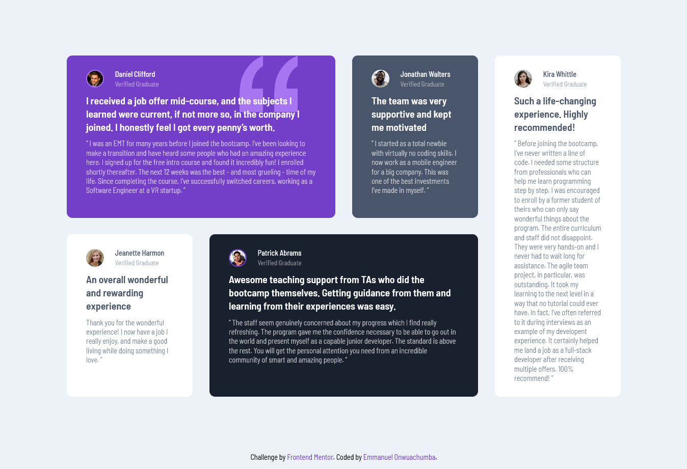

# Frontend Mentor - Testimonials grid section solution

This is a solution to the [Testimonials grid section challenge on Frontend Mentor](https://www.frontendmentor.io/challenges/testimonials-grid-section-Nnw6J7Un7). Frontend Mentor challenges help you improve your coding skills by building realistic projects.

## Table of contents

- [Overview](#overview)
  - [The challenge](#the-challenge)
  - [Screenshot](#screenshot)
  - [Links](#links)
- [My process](#my-process)
  - [Built with](#built-with)
  - [What I learned](#what-i-learned)
  - [Continued development](#continued-development)
- [Author](#author)

## Overview

### The challenge

Users should be able to:

- View the optimal layout for the site depending on their device's screen size

### Screenshot

### Links

- Solution URL: [Frontend Mentor](https://www.frontendmentor.io/challenges/testimonials-grid-section-Nnw6J7Un7)
- Live Site URL: [https://fem-testimonials-grid-challenge.netlify.app](https://fem-testimonials-grid-challenge.netlify.app)

## My process

### Built with

- Semantic HTML5 markup
- CSS custom properties
- Flexbox
- CSS Grid

### What I learned

I gained a deeper understanding of CSS grid properties like: `grid-template-columns` and `grid-template-rows`, and how they can be used to place items within the grid container.

### Continued development

I plan to build more Frontend Mentor projects to help me sharpen my HTML, CSS and JavaScript skills.

## Author

- Website - [Emmanuel Onwuachumba](https://github.com/devmanuel1)
- Frontend Mentor - [@devmanuel1](https://www.frontendmentor.io/profile/devmanuel1)
- Twitter - [@devmanuel\_](https://www.twitter.com/devmanuel_)
